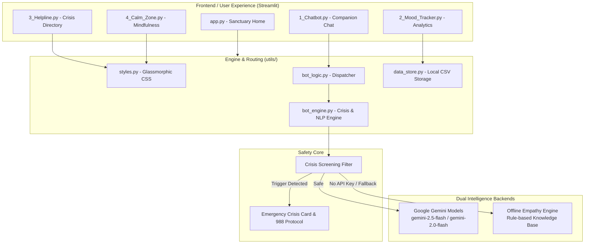

<div align="center">

# 🧠 EmpathyBot 2.0
### *Next-Generation Virtual Emotional Wellness & Mindfulness Companion*

[](https://python.org)
[](https://streamlit.io)
[](https://ai.google.dev/)
[](https://plotly.com/)
[](https://opensource.org/licenses/MIT)
[](#-automated-testing)

<p align="center">
  <b>A private, judgment-free emotional sanctuary combining conversational AI, somatic grounding, real-time crisis safeguards, and interactive lifestyle analytics.</b>
</p>

[Explore Features](#-features-overview) •
[Quick Start](#-quick-start) •
[Architecture](#-architecture) •
[Testing](#-automated-testing) •
[Clinical Disclaimer](#-clinical-safety-disclaimer)

</div>

---

## 📖 Overview

**EmpathyBot 2.0** is an evidence-informed, local-first emotional health companion web application. Designed around principles of **Cognitive Behavioral Therapy (CBT)**, **Somatic Grounding**, and **Mindful Self-Compassion**, EmpathyBot empowers users to deconstruct overwhelming thoughts, track emotional trajectories over time, and practice regulated breathing during moments of acute stress.

EmpathyBot functions in **hybrid intelligence mode**:
- **🟢 Advanced AI Mode**: Contextual, multi-turn emotional dialogue powered by the modern **Google Gemini** API (`google-genai` & `google-generativeai`).
- **🔵 Offline Empathy Engine**: Completely local, rule-based conversational intelligence that operates without network access or third-party API keys.

---

## 🌟 Features Overview

### 1. 💬 Companion Chat Studio
Talk through your thoughts with three custom-calibrated companion personas:
- **🌿 Serene**: Calming, soft, and mindfulness-centered; focuses on slow breathing, de-escalation, and gentle grounding.
- **⚡ Joy**: Radiant, validating, and optimistic; celebrates minor victories and reinforces self-compassion.
- **🧠 Sage**: Reflective, structured, and analytical; applies CBT frameworks to help deconstruct cognitive distortions (e.g., catastrophizing, black-and-white thinking).

**Chat Capabilities:**
- **Quick-Starter Chips**: One-tap conversation prompts (*"Anxious about work"*, *"Need to vent"*, *"Celebrate a win"*, *"Can't sleep"*).
- **Live Sentiment Tracking**: Real-time emotion classification displayed as dynamic status badges.
- **Transcript Export**: Download your conversation as a `.txt` file for personal journaling or discussion with a therapist.
- **Instant Reset**: Clear session conversation or restart with a single click.

---

### 2. 📊 Mood Journey & Plotly Analytics
Understand your emotional rhythms by tracking daily wellness ratings and their underlying lifestyle drivers.
- **KPI Summary Cards**: Live metrics displaying Total Reflections, Average Score (1-10), Dominant Emotional Tone, and Top Contributing Lifestyle Driver.
- **Interactive Timeframe Filtering**: Switch between *All Time*, *Past 30 Days*, and *Past 7 Days*.
- **Plotly Express Visualizations**:
  - **Temporal Area Curve**: Smooth wellness score progression over time with hover inspection.
  - **Donut Chart**: Emotion distribution and frequency breakdown.
  - **Horizontal Bar Graph**: Average wellness score segmented by lifestyle factors (Sleep, Exercise, Relationships, Work, Diet, Mindfulness).
- **Reflection Journal Feed**: Chronological card feed of past journal entries with granular single-entry deletion.
- **Instant Demo Loader**: One-click **"✨ Load Sample Data"** button generates 14 days of realistic mock history for immediate analytics evaluation.
- **Data Export**: One-click CSV download for personal backup and external analysis.

---

### 3. 🧘 Calm Zone & Mindfulness Studio
Dedicated somatic and cognitive regulation toolkit accessible anytime:
- **🌬️ Breathing Studio**: High-frame-rate CSS keyframe animated breathing visualizers with phase-by-phase guidance:
  - **Box Breathing (4-4-4-4)**: Inhale 4s ➔ Hold 4s ➔ Exhale 4s ➔ Hold 4s (used by first responders and athletes).
  - **Calming 4-7-8**: Inhale 4s ➔ Hold 7s ➔ Exhale 8s (natural nervous system tranquilizer).
  - **Coherent Rhythm (5-5)**: Resonant breathing at ~6 breaths per minute to synchronize heart rate variability (HRV).
- **🖐️ 5-4-3-2-1 Sensory Grounding Tool**: Step-by-step interactive checklist that forces the brain to disengage from panic and reconnect with physical reality (5 seen, 4 touched, 3 heard, 2 smelled, 1 tasted).
- **✨ Mindful Affirmations Deck**: Curated, cognitive-reframing affirmations categorized across *Anxiety Relief*, *Self-Worth*, *Courage*, and *Evening Rest*.

---

### 4. 🚨 Crisis Safeguard & Global Helpline Directory
Safety is foundational to EmpathyBot.
- **Real-Time Sentiment Screening**: High-priority keyword and regex screening monitors incoming chat input for acute crisis or self-harm triggers.
- **Emergency Override**: Detection immediately halts standard dialogue, replaces the interface with a protective crisis card, and links directly to emergency hotlines.
- **Global Verified Helpline Directory**:
  - 🇺🇸 **United States**: 988 Lifeline, Crisis Text Line (741741), Trevor Project, Veterans Crisis Line.
  - 🇬🇧 **United Kingdom**: Samaritans (116 123), NHS Mental Health (111), Shout (85258), PAPYRUS.
  - 🇮🇳 **India**: Kiran (1800-599-0019), AASRA (+91-9820466726), Vandrevala Foundation, Tele-MANAS (14416).
  - 🇨🇦 **Canada**: 988 Suicide Crisis Helpline, Kids Help Phone, Hope for Wellness.
  - 🇦🇺 **Australia**: Lifeline (13 11 14), Beyond Blue (1300 22 4636), Kids Helpline.
  - 🇪🇺 **Europe**: 112 Universal Emergency, SOS Amitié, TelefonSeelsorge.
  - 🌐 **International**: Direct access to Find A Helpline, Befrienders Worldwide, and IASP.
- **One-Touch Calling**: Direct `tel:` and `sms:` links allow users on mobile or VoIP devices to connect with a single tap.
- **Immediate Grounding Routine**: Somatic dive reflex, physical anchoring, and structured outreach guidance.

---

## 🏗️ Architecture



---

## 🛠️ Technology Stack

| Layer | Technology | Purpose |
|---|---|---|
| **Framework** | [Streamlit](https://streamlit.io/) `1.40+` | Reactive multi-page web application engine |
| **Styling** | Vanilla CSS3, Glassmorphism, Google Fonts (`Plus Jakarta Sans`) | Dark modern aesthetic, responsive cards, micro-animations |
| **Visualizations** | [Plotly Express](https://plotly.com/python/) & [Matplotlib](https://matplotlib.org/) | Dynamic area graphs, donut distributions, factor correlation bars |
| **AI / NLP** | [Google GenAI SDK](https://github.com/google-gemini/generative-ai-python) (`google-genai` & `google-generativeai`) | Context-aware empathetic dialogue with multi-model fallback |
| **Local Storage** | [Pandas](https://pandas.pydata.org/) & CSV | Local-first persistent mood metrics and reflection logs |
| **Environment** | [Python-Dotenv](https://github.com/theskumar/python-dotenv) | Automated local API key discovery |
| **Testing** | Standard Library `unittest` | Automated validation of sentiment, crisis rules, and storage |

---

## 🚀 Quick Start

### Prerequisites
- Python `3.10` or higher
- Git

### 1. Clone Repository
```bash
git clone https://github.com/Deepanshu779/EmpathyBot2.0.git
cd EmpathyBot2.0
```

### 2. Create and Activate Virtual Environment
```bash
# Windows (PowerShell)
python -m venv venv
.\venv\Scripts\Activate.ps1

# macOS / Linux
python3 -m venv venv
source venv/bin/activate
```

### 3. Install Dependencies
```bash
pip install -r requirements.txt
```

### 4. (Optional) Configure Google Gemini API Key
To use Advanced AI Mode, configure a free API key from [Google AI Studio](https://aistudio.google.com/):
```bash
# Copy the environment template
cp .env.example .env

# Edit .env to set your key
GEMINI_API_KEY=your_gemini_api_key_here
```
> **Note:** If no key is configured, EmpathyBot operates automatically in **Offline Empathy Engine Mode**. You can also enter or update your key at any time in the app's sidebar settings.

### 5. Launch the Application
```bash
streamlit run app.py
```
Your default browser will automatically open at `http://localhost:8501`.

---

## 📂 Repository Structure

```
EmpathyBot2.0/
├── app.py                       # Application Landing Page & Quick Mood Check-In
├── requirements.txt             # Project Dependencies
├── .env.example                 # Environment Variable Template
├── .gitignore                   # Git Ignore Rules
├── .streamlit/
│   └── config.toml              # Streamlit Theme & Server Settings
├── pages/                       # Multi-Page Navigation
│   ├── 1_Chatbot.py             # Companion Chat Studio
│   ├── 2_Mood_Tracker.py        # Mood Analytics & Reflection Journal
│   ├── 3_Helpline.py            # Global Emergency Crisis Directory
│   └── 4_🧘_Calm_Zone.py        # Breathing Visualizers, Grounding & Affirmations
├── utils/                       # Shared Backend Engines
│   ├── bot_engine.py            # Gemini API integration, offline rules & crisis checker
│   ├── bot_logic.py             # Dispatcher and backward-compatible wrappers
│   ├── data_store.py            # CSV persistence, sample generator & CRUD methods
│   └── styles.py                # Glassmorphic CSS design system & SVG breathing animations
├── tests/                       # Automated Test Suite
│   └── test_empathy_bot.py      # Unit tests for NLP, crisis safeguards, and data store
├── mood_logs.csv                # Local CSV storage for mood reflections
└── README.md                    # Project Documentation
```

---

## 🧪 Automated Testing

EmpathyBot includes a comprehensive unit test suite validating:
- Self-harm crisis keyword detection and elimination of false positives.
- Multi-category emotional sentiment classification.
- Response generation across all three companion personas.
- Data store initialization, appending, sample data population, and entry deletion.

Run tests using Python's built-in `unittest` runner:
```bash
python -m unittest discover -s tests -p "test_*.py" -v
```

**Test Execution Sample:**
```
test_append_and_load (test_empathy_bot.TestDataStore) ... ok
test_delete_mood_log (test_empathy_bot.TestDataStore) ... ok
test_sample_data_population (test_empathy_bot.TestDataStore) ... ok
test_configured_api_key_type (test_empathy_bot.TestEmpathyBotEngine) ... ok
test_crisis_detection (test_empathy_bot.TestEmpathyBotEngine) ... ok
test_crisis_no_false_positives (test_empathy_bot.TestEmpathyBotEngine) ... ok
test_mood_detection (test_empathy_bot.TestEmpathyBotEngine) ... ok
test_offline_personas (test_empathy_bot.TestEmpathyBotEngine) ... ok

Ran 8 tests in 0.25s — OK
```

---

## 🔒 Privacy & Local-First Philosophy

- **Zero Telemetry**: Mood metrics, journal reflections, and personal entries are saved **strictly on your local machine** inside `mood_logs.csv`.
- **API Key Security**: If provided, your Gemini API key is used exclusively in-memory for model communication and is never logged, stored in databases, or transmitted elsewhere.
- **Full Data Ownership**: You can export your data as CSV or purge all persistent records at any time using the **"Clear App Data"** button in the sidebar.

---

## ⚠️ Clinical Safety Disclaimer

> [!IMPORTANT]
> **EmpathyBot 2.0 is an artificial intelligence technological demonstration created for emotional reflection, grounding, and mindfulness support.**
> 
> - It is **NOT** a certified medical device, clinical diagnostic instrument, or suicide prevention service.
> - It does **NOT** substitute for professional medical advice, psychotherapy, psychiatric diagnosis, or treatment.
> - If you, a friend, or a loved one are experiencing acute psychological distress, self-harm impulses, or a medical emergency, please discontinue use immediately, navigate to the **[Helpline Directory](file:///d:/PROJECTS/EmpathyBot2.0/pages/3_Helpline.py)**, or dial your local emergency services (such as **988** in the US/Canada or **112** in Europe).

---

## 🤝 Contributing

Contributions are warmly welcomed! To contribute:
1. Fork the repository.
2. Create a descriptive feature branch (`git checkout -b feat/mindfulness-audio`).
3. Commit your changes with conventional commits (`git commit -m 'feat: add ambient rain sound visualizer'`).
4. Run the test suite to ensure no regressions (`python -m unittest discover -s tests`).
5. Push to the branch (`git push origin feat/mindfulness-audio`) and open a Pull Request.

---

## 📄 License

Distributed under the **MIT License**. See `LICENSE` for more information.

<div align="center">
  <sub>Built with compassion and modern code by <a href="https://github.com/Deepanshu779">Deepanshu</a>.</sub>
</div>
